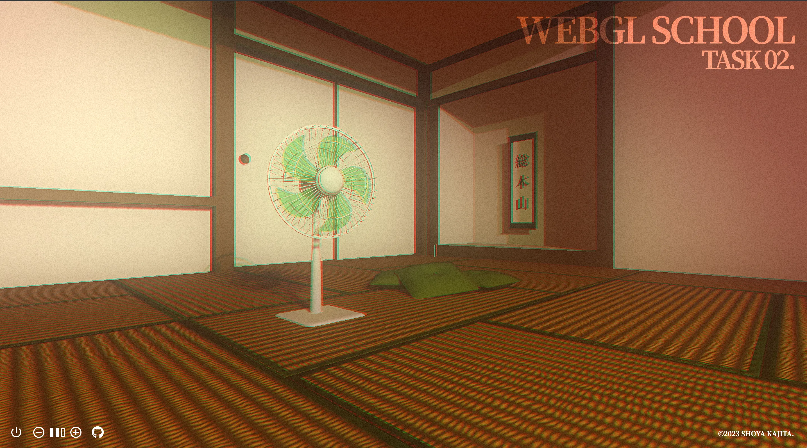

# Task.02 ~ WebGL スクール第 10 期

## 🪬 ~ 要件

- `new THREE.Group();`を使用すること
- 「回転する羽」と「首振り」機能を実現すること

## 👾 ~ Demo

- https://dev.shoya-kajita.com/017/



## 🎮 ~ Getting Started

- node : v.17.0.0
- npm : 8.1.0

```
// install
npm i

// development
npm run dev

// production
npm run build

// build preview
npm run preview
```

## 📝 ~ Note
